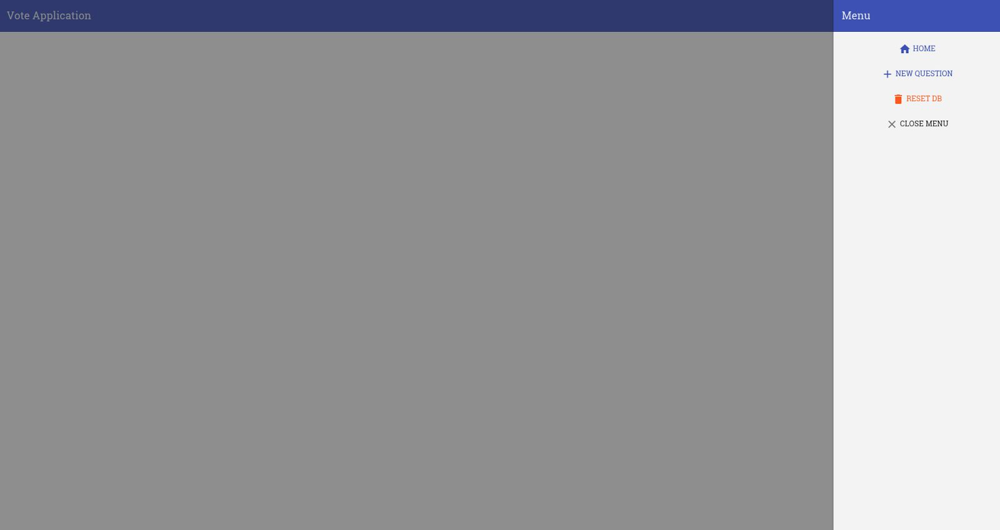
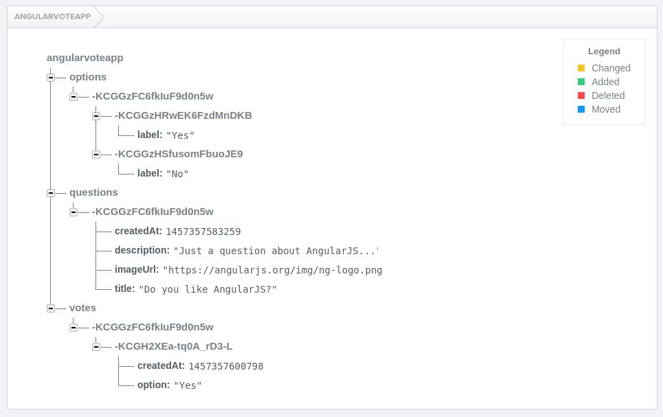
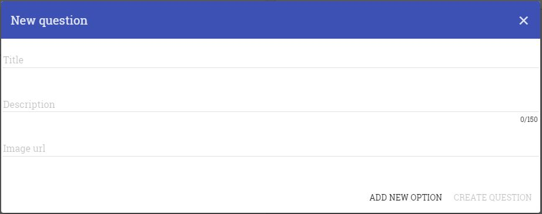
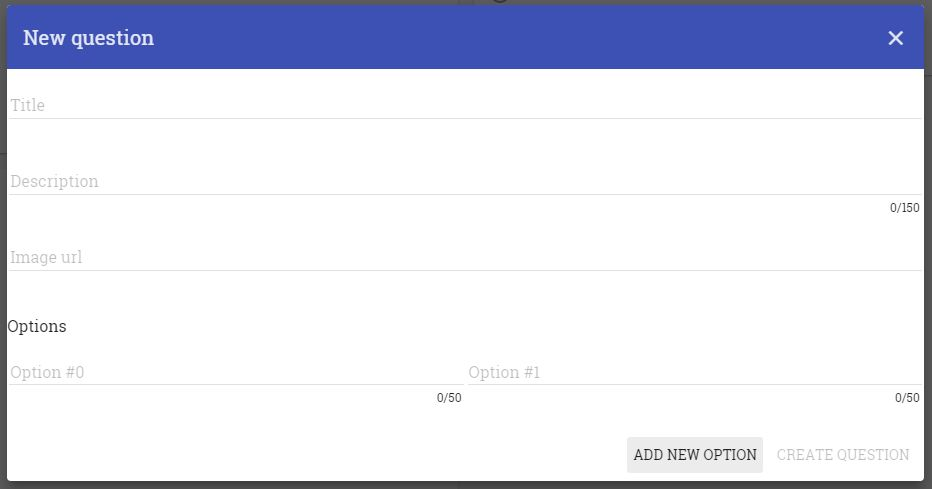
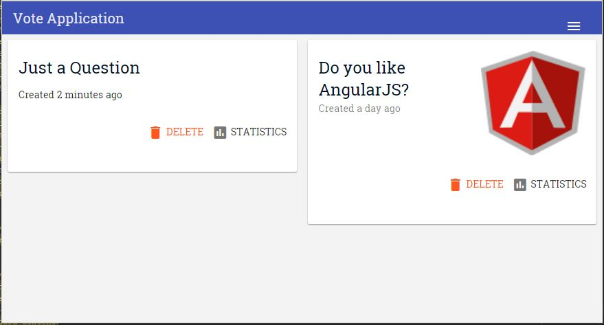
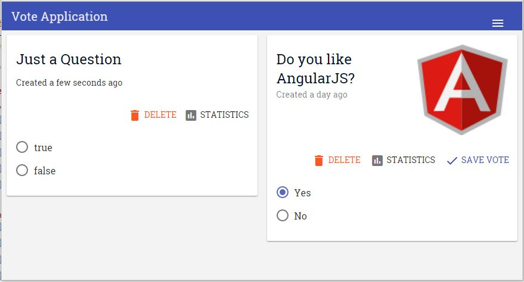
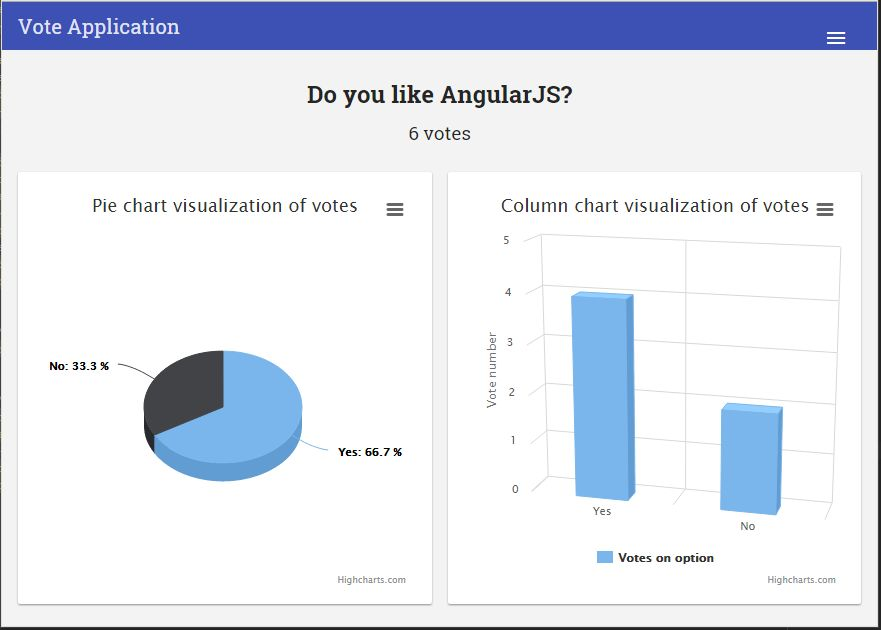

# Adatvizualizáció Gyakorlat
## Segédlet az Üzleti intelligencia c. tárgyhoz

### Tartalom
* [Bevezetés](#bevezetés)
  * [Célkitűzés](#célkitűzés)
  * [AngularJS](#angularjs)
  * [Előfeltételek](#előfeltételek)
  * [Technológiák](#technológiák)
  * [Röviden az alkalmazásról](#röviden-az-alkalmazásról)
* [Feladatok](#feladatok)
  * [1. Feladat - Kérdés létrehozása alap adatokkal (opciók nélkül)](#1-feladat---kérdés-létrehozása-alap-adatokkal-opciók-nélkül)
  * [2. feladat - Opciók hozzáadása](#2-feladat---opciók-hozzáadása)
  * [3. feladat - Kérdések megjelenítése a főoldalon](#3-feladat---kérdések-megjelenítése-a-főoldalon)
  * [4. feladat - Szavazás](#4-feladat---szavazás)
    * [Önálló feladatok](#Önálló-feladatok)
  * [5. feladat - Statisztikák](#5-feladat---statisztikák)
* [Visszajelzés](#visszajelzés)

### Bevezetés

#### Célkitűzés
A labor során egy egyszerű szavazó alkalmazást fogunk elkészíteni. Ennek alapjai már megtalálhatóak a kiinduló forrásban, ezt fogjuk kiegészíteni további funkciókkal. 

#### AngularJS
[AngularJS rövid ismertető](docs/angular_help.md)

#### Előfeltételek
A gyakorlat elvégzéséhez nincs szükség telepítésre Windows-on, minden megtalálható az indításhoz a forrásban.

> Ha más operációs rendszeren szeretnénk elindítani az alkalmazást, akkor elegendő a **Node.js** telepítése, majd *npm* segítségével a *http-server* modult tegyük fel: `npm install http‐server ‐g`

Ezek után a projekt indítása:

```
http-server -c-1
```

Böngészőben: http://localhost:8080



#### Technológiák
* [AngularJS](https://docs.angularjs.org/guide)
* [Angular Material](https://material.angularjs.org/latest)
* [Firebase](https://www.firebase.com/docs)
* [Highcharts](http://www.highcharts.com/docs)

#### Röviden az alkalmazásról
Az elkészült alkalmazásban a felhasználó tud: 
* létrehozni kérdéseket, a kérdésben megadható:
  * a kérdés (**title**)
  * leírás (**description**)
  * kép (**imageUrl**)
  * lehetséges válaszok, amelyekre a felhasználó szavazhat (**options**)
* törölni kérdéseket
* szavazni kérdésekre
* megtekinteni a szavazás állását

Az adatbázisban a következőképpen tároljuk az objektumokat:



A séma tehát a következőképpen néz ki: Az **angularvoteapp** gyökérnek 3 gyermeke van: 
* questions
* options
* votes

Egy kérdéshez felvehetünk több válaszlehetőséget (**option**), ez a gyakorlatban azt jelenti, hogy az options alatt a kérdés azonosítójának megfelelő gyermekhez szúrjuk be az új option-t. 
Ez teszi lehetővé, hogy egyszerűen le tudjuk kérdezni az adott kérdéshez tartozó optionöket. Ugyanígy hozzuk létre az új szavazatot is, a votes gyerek alá beszúrjuk a kérdés azonosítóját és az alá kerül a vote objektum. 
(A fenti képen például látható, hogy a kérdés azonosítója *-KCG….n5w*, amely megjelenik az options és a votes alatt is. 

Összefoglalva az adott objektumok és lehetségek mezők:
* Question
  * title
  * description
  * imageUrl
  * createdAt
* Option
  * label
* Vote
  * option
  * createdAt


### Feladatok

#### 1. Feladat - Kérdés létrehozása alap adatokkal (opciók nélkül)



Az oldalsó navigációs sávban már elérhető az új kérdés létrehozás opció, melynek hatására felugrik egy dialógus ablak de szinte üres. Ehhez először vegyük fel a szükséges mezőket.
A dialógushoz tartozik egy kontroller fájl: `new.question.dialog.controller.js` 
A kontrollerben tudunk definiálni változókat, amelyekhez a view-ban szeretnénk hozzáférni. 

A dialog kontrollere így néz ki jelenleg:

```javascript
angular .module('angularVoteApp')
 .controller('NewQuestionDialogController', NewQuestionDialogController);

/** @ngInject */
function NewQuestionDialogController($mdDialog, QuestionService, OptionService, NotificationService) {
var vm = this;
}
```

A `vm` változóra tudunk ráaggatni minden olyan objektumot, függvényt, amit a view-ból el akarunk érni. Elsőként hozzunk létre egy új kérdést, melyhez hozzákötjük majd az input mezőket: 

```javascript
vm.question = new QuestionService.Question();
```

A `QuestionService`-t megtekintve láthatjuk, hogy ennek 4 változója van: 
* title
* description
* imageUrl
* createdAt

Ebből az első hármat kell kirakni a dialógus template-re (app/components/question/new/new.question.dialog.html): 

```html
<md-dialog-content>
       <div>
           <md-input-container class="md-block" flex-gt-sm>
               <label>Title</label>
               <input ng-model="vm.question.title" required>
           </md-input-container>
           <md-input-container class="md-block">
               <label>Description</label>
               <textarea ng-model="vm.question.description" md-maxlength="150" rows="5"
                         md-select-on-focus></textarea>
           </md-input-container>
           <md-input-container class="md-block" flex-gt-sm>
               <label>Image url</label>
               <input ng-model="vm.question.imageUrl">
           </md-input-container>
       </div>
</md-dialog-content>
```

Kössük be a kérdés mentését is a formra. A `form` tag-en belül hozzuk létre az `md-dialog-actions` részt: 

```html
<md-dialog-actions layout="row">
    <md-button class="md-primary" ng-disabled="NewQuestionForm.$invalid">
       Create Question
   </md-button>
</md-dialog-actions>
```


A gombhoz adjunk eseménykezelőt:
 
```javascript
ng-click="vm.create()"
```

A kontrollerben írjuk meg ezt a függvényt:

```javascript
vm.create = function (){
 QuestionService.addQuestion(vm.question).then(function (question) {
      NotificationService.showNotification("Question created successfully.");
   vm.hide();
 });
};
```

#### 2. feladat - Opciók hozzáadása



Egy kérdéshez még tartoznak válaszlehetőségek is (**options**). Egy `Option` objektum felépítése megtekinthető az `OptionService`-ben (app/components/option/option.service.js):

```javascript
function Option(){
 this.label = '';
}
```

A válaszlehetőségek felvitelét is adjuk hozzá az új kérdés formhoz. Az `md-dialog-content` tag-en belül:

```html
<div>
     <label>Options</label>
     <div layout="row" layout-wrap>
         <md-input-container class="md-block" flex="50" ng-repeat="option in vm.options track by $index">
             <label>Option #{{ $index }}</label>
<textarea ng-model="option.label" columns="1"
         md-maxlength="50" rows="1" aria-multiline="true"
         aria-required="true"
         aria-invalid="true" ng-trim="false"></textarea>
         </md-input-container>
     </div>
 </div>
```

 Tegyünk ki egy új option létrehozó gombot (app/components/question/new/new.question.dialog.html):
 
```html 
<md-dialog-actions layout="row">
   <md-button ng-click="vm.addNewOption()">
       Add new option
   </md-button>
   <md-button class="md-primary" ng-click="vm.create()" ng-disabled="NewQuestionForm.$invalid">
       Create Question
   </md-button>
</md-dialog-actions>
```

A dialógus kontrollerjében hozzuk létre az `addNewOption` függvényt: 

```javascript
vm.addNewOption = function () {
 vm.options.push(new OptionService.Option());
};
```

Az `OptionService` (app/components/option/option.service.js) jelenleg így néz ki:

```javascript
angular
 .module('angularVoteApp')
 .factory('OptionService', OptionService);

/** @ngInject */
function OptionService($firebaseArray, FirebaseDataService) {
 var options = null;

 var service = {
   Option: Option,
  };

 init();

 return service;

 function Option(){
   this.label = '';
 }

 function init(){
  }
}
```

Egészítsük ki az `init` függvényt úgy, hogy `options` változót a Firebase array-hez kötjük:

```javascript
function init(){
options = $firebaseArray(FirebaseDataService.options);
}
```

> A `$firebaseArray` egy Firebase service, amivel ún. *synchronized array*-t tudunk létrehozni. Jelen esetben az adatbázisban található *options* gyermekből készítünk ilyen tömböt, melynek elemeit
> a Firebase service által biztosított különféle API-k segítségével tudjunk módosítani (pl. `options.$add(option)` függvény egy új option rekordot ad hozzá az options tömbhöz). 

Ezek után 2 függvényre lesz szükség:
 
* `addOptionsToQuestion` (option hozzáadása a kérdéshez, adott `questionId`-hez szúrjuk be az options objektumhoz)	

```javascript
function addOptionsToQuestion(questionId, options){
   _.forEach(options, function (option) {
     FirebaseDataService.options.child(questionId).push(option);
   });
 }
```

* `getOptionsToQuestion` (`Option`-ök lekérdezése adott question-höz, options `questionId`-hez tartozó gyerekeit kérjük le)

```javascript
function getOptionsToQuestion(question){
 return $firebaseArray(FirebaseDataService.options.child(question.$id));
}
```

Megírt függvények publikussá tétele a service objektumban:

```javascript
var service = {
   Option: Option,
   addOptionsToQuestion: addOptionsToQuestion,
   getOptionsToQuestion: getOptionsToQuestion
};
```

Ezek után már tudjuk használni a service függvényeit az új kérdés létrehozó formon. 

Form mentésénél az option-öket is el akarjuk menteni, ezért a `vm.create` függvény `addQuestion` promise-ban meghívjuk az előző `addOptionsToQuestion` függvényt az adott paraméterekkel:

```javascript
var id = question.key();
OptionService.addOptionsToQuestion(id,vm.options);
```

Ezek után ha kipróbáljuk, el tudjuk menteni a felvett válaszlehetőségeket is új kérdés létrehozásánál. 

#### 3. feladat - Kérdések megjelenítése a főoldalon



A kérdések megjelenítéséhez először is le kell kérnünk őket a `QuestionsController`-ben (app/components/question/questions.controller.js):
 
```javascript 
function QuestionsController(QuestionService, VoteService, $mdDialog) {
 var vm = this;
 vm.questions = QuestionService.getQuestions();
}
```

A kérdések nézet template-jében pedig felveszünk egy listát (app/components/question/questions.html):
 
```html 
<md-content layout-xs="column" layout-gt-xs="row" layout-wrap>
 <question-list-item question="question"  flex-xs flex-gt-xs="50"
                     ng-repeat="question in vm.questions | orderBy: '-createdAt'"></question-list-item>
</md-content>
```

Amint látható ez egy `question-list-item` nevű direktíva, amely egy adott kérdés listaelem megjelenítéséért felelős. A `question-list-item` scope-jának átadjuk az adott `question` elemet. 
A direktíva definíciója a `question.list.item.directive.js`-ben található (app/components/question/list/question.list.item.directive.js):

```javascript
var directive = {
 restrict: 'E',
 templateUrl: 'app/components/question/list/question.list.item.directive.html',
 scope: {
   question: '='
 },
 controller: QuestionListItemController,
 controllerAs: 'vm',
 bindToController: true
};
```

> A definícióból látható, hogy a direkítvára elemenként tudunk hivatkozni (`restrict:’E’`), a hozzátartozó template pedig a mellette található `question.list.item.directive.html`. A direktíva izolált scope-al rendelkezik, egy question mezője van, amit a direktíva question attribútumában adhatunk meg (ezért írtuk a kérdések listában így:  `<question-list-item question="question" … `). 
> Az átadott question objektumra `vm.question`-ként tudunk hivatkozni a direktíván belül. 
> A direktíva kontrollere a `QuestionListItemController`, mely szintén ebben a JavaScript fájlban található. 

Kérjük le a kérdéshez található válaszlehetőségeket ebben a kontrollerben: 

```javascript
vm.options = null;

activate();
function activate(){
 vm.options = OptionService.getOptionsToQuestion(vm.question);
}
```

Jelenítsük meg a direktíva template fájlban a kérdés részleteit (app/components/question/list/question.list.item.directive.html): 

```html
<md-card>
 <md-card-title>
   <md-card-title-text>
     <a ui-sref="statistics({id: vm.question.$id})"><span class="md-headline">{{ vm.question.title }}</span></a>
     <span class="md-subhead">Created {{ vm.question.createdAt | readabledate }}</span>
   </md-card-title-text>
   <md-card-title-media ng-if="vm.question.imageUrl">
     
   </md-card-title-media>
 </md-card-title>
 <md-card-actions layout="row" layout-align="end center">
   <md-button class="md-warn" ng-click="vm.showConfirm()">
     <md-icon md-font-library="material-icons" >delete</md-icon>
     Delete
   </md-button>
   <md-button ui-sref="statistics({id: vm.question.$id})">
     <md-icon md-font-library="material-icons">insert_chart</md-icon>
     Statistics
   </md-button>
 </md-card-actions>
 <md-card-content>

 </md-card-content>
</md-card>
```

Az option-ket radio button-ként jelenítettük meg (`md-card-content` elemen belül): 
 
```html
 <md-radio-group class="md-primary">
     <md-radio-button ng-repeat="option in vm.options"
                      ng-value="option.label">
       {{ option.label }}<br/>
     </md-radio-button>
   </md-radio-group>
```

#### 4. feladat - Szavazás



A főoldalon már van egy listánk a feltett kérdésekről, a kérdéseken belül pedig már a válaszlehetőségeket is látjuk. A következő lépésben elkészítjük a szavazást is.

A terv az, hogy az aktuálisan kiválasztott `option`-t eltároljuk egy `selected` nevű változóban és ha a felhasználó rányom a szavazásra, akkor a `selected`-ben tárolt option-t elmentjük. Ehhez a listaelem direktíva kontrollerében vegyük fel ezt a változót: 

```javascript
vm.selected = null;
```

A listaelem nézeten (app/components/question/list/question.list.item.directive.html) kössük az aktuálisan kiválasztott `option`-t ehhez a változóhoz: 

```html
 <md-radio-group ng-model="vm.selected"  class="md-primary">
     <md-radio-button ng-repeat="option in vm.options"
                      ng-value="option.label">
       {{ option.label }}<br/>
     </md-radio-button>
   </md-radio-group>
```

##### Önálló feladatok

* Ugyanitt rakjunk ki egy gombot, amelyre kattintva a felhasználó szavazni fog
  * Ehhez kell egy függvény a kontrollerben, amit rárakunk a `scope`-ra
  * A szavazás mentését pedig a `VoteService`-ben is implementáljuk (app/components/vote/vote.service.js) → Ehhez egy új `Vote` objektumot kell eltárolni a votes-ban a kérdés azonosítójához rendelve
  * Ez a gomb csak  akkor jelenjen meg, ha kiválasztottunk egy `option`-t (használjuk az `ng-if` beépített AngularJS direktívát) 
* A szavazás után a felhasználónak jelenjen meg egy értesítés, hogy sikeresen szavazott a kérdésre (Ehhez használjuk a `NoficationService` `showNotification` függvényét, melyet itt találunk: app/components/notification/notification.service.js)

#### 5. feladat - Statisztikák



A statisztikák nézeten már láthatóak az eredmények kördiagram formájában. A feladat, hogy oszlopdiagram formájában is jelenítsük meg a szavazás állását.

Ehhez a `highchartsColumn` nevű direktívát kell kiegészíteni (app/components/statistics/highcharts.column.directive.js). Segítségül a kördiagram direktívája szolgál (highcharts.pie.directive.js). 

> Az oszlopdiagramra példa itt található: http://www.highcharts.com/demo/column-rotated-labels

A direktíva megkapja paraméterben a kirajzolandó adatokat (`vm.columnChartData`-ként tudunk rá hivatkozni), `categories` és `data` mezőit kell átadni a diagramrajzoló libnek.

### Visszajelzés
A visszajelzés fontos számunka. Segíted vele a munkánkat és többi hallgató életét: http://goo.gl/forms/RU00lo5ycc


