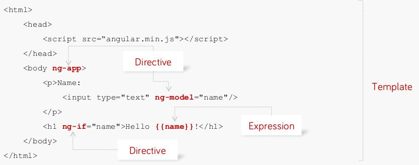

# AngularJS

## Tartalom
* [Mi az AngularJS?](#mi-az-angularjs)
* [AngularJS főbb komponensei](#angularjs-főbb-komponensei)
  * [Modulok](#modulok)
  * [Kifejezések](#kifejezések)
  * [Scope](#scope)
  * [Controller](#controller)
  * [Directive](#directive)
  * [Service](#service)

### Mi az AngularJS? 
JavaScript Single Page Application (SPA) keretrendszer, segítségével: 
* Jól szervezett és nagyon moduláris alkalmazást tudunk készíteni
* HTML szintaxist tudjuk kibővíteni saját komponensekkel 
* Kevesebb kódot kell írnunk 
* Adatkötés: automatikus szinkronizáció model és view komponensek között

Egyszerű AngularJS példa:



### AngularJS főbb komponensei

#### Modulok
* Konténer a többi komponens (controller, service. directive stb.) számára
* Deklaratívan meghatározza hogyan jön létre az alkalmazás
* Kód becsomagolása újrahasználható modulként
* Egy modul függhet más moduloktól is

Modul deklarációja:

```javascript
var myApp = angular.module('myApp', []);
```

A második paraméter egy tömb, amelyben felsorolhatjuk a modul függőségeit (más modulok).

#### Kifejezések 
JavaScript-szerű kódrészletek

```javascript
<span title="{{ attrBinding }}">{{ textBinding }}</span>
```

```javascript
<span>
  1+2={{1+2}}
</span>
```

#### Scope
A scope egy objektum, mely 
* hivatkozik az alkalmazás modellre
* ragasztó a nézet és a kontroller között
* hierarchikus struktúra
* kifejezések változásaira figyelhetnek és eseményeket propagálhatnak
* A kontrollerek és a direktívák is rendelkeznek referenciával a scope-ra de egymásra nem

#### Controller
Adott nézethez tartozó üzleti logika tárolására. Új child scope-ot hoz létre, amely injektálható a kontroller konstruktor függvényének paramétereként (`$scope`).

Használjuk a $scope objektum kezdeti állapotának beállítására és hogy viselkedést társítsunk hozzá (pl. click esemény kezelő függvény).

Példa kontroller definiálására:

```javascript
myApp.controller('DoubleController', ['$scope', function($scope) {
  $scope.double = function(value) { return value * 2; };
}]);
```

hivatkozás rá a DOM-ban:

```javascript
<div ng-controller="DoubleController">
  Two times <input ng-model="num"> equals {{ double(num) }}
</div>
```

controllerAs szintaxissal: 

```javascript
myApp.controller('DoubleController', ['$scope', function($scope) {
  var vm = this;
  vm.double = function(value) { return value * 2; };
}]);
```

hivatkozás a DOM-ban:

```javascript
<div ng-controller="DoubleController as doubleCtrl">
  Two times <input ng-model="doubleCtrl.num"> equals {{ doubleCtrl.double(doubleCtrl.num) }}
</div>
```

A controllerAs szintaxis segítségével az egymásba ágyazott scope-okat jobban meg tudjuk különböztetni:

```html
<div ng-controller="MainCtrl as main">
  {{ main.title }}
  <div ng-controller="AnotherCtrl as another">
    Scope title: {{ another.title }}
    Parent title: {{ main.title }}
    <div ng-controller="YetAnotherCtrl as yet">
      Scope title: {{ yet.title }}
      Parent title: {{ another.title }}
      Parent parent title: {{ main.title }}
    </div>
  </div>
</div>
```

Míg sima scope-al így néz ki: 

```html
<div ng-controller="MainCtrl">
  {{ title }}
  <div ng-controller="AnotherCtrl">
    Scope title: {{ title }}
    Parent title: {{ $parent.title }}
    <div ng-controller="YetAnotherCtrl">
      {{ title }}
      Parent title: {{ $parent.title }}
      Parent parent title: {{ $parent.$parent.title }}
    </div>
  </div>
</div>
```

#### Directive

Felhasználható:
* Speciális viselkedés kapcsolására valamely DOM elemhez
* DOM elem, annak gyerekeinek módosítására

Sok beépített AngularJS direktíva van (pl. `ng-repeat`, `ng-model`, `ng-controller`, `ng-app` stb.), de írhatunk sajátot is.

Honnan tudjuk melyik DOM elemre vonatkozik? DOM elem megjelölésének lehetőségei:
* Attribútum

```html
<span my-dir="exp"></span>
```

* Elem neve 
```html
<my-dir></my-dir>
```
* CSS osztály
```html
<span class="my-dir: exp;"></span>
```
* Komment
```html
<!-- directive: my-dir exp -->
```

Direktíva definiálása:

```javascript
angular.module('docsSimpleDirective', [])
.controller('Controller', ['$scope', function($scope) {
  $scope.customer = {
    name: 'Naomi',
    address: '1600 Amphitheatre'
  };
}])
.directive('myCustomer', function() {
  return {
    template: 'Name: {{customer.name}} Address: {{customer.address}}'
  };
});
```

#### Service
* *"Separation of Concerns"* koncepció támogatására
* JavaScript függvények, melyek egy speciális feladatot látnak el
* Kontrollerek, filterek hívják meg általában, Dependency Injection mechanizmussal injektálhatóak.
* Sok beépített service létezik, mint pl. `$http`, `$route`, `$window`, `$location` stb. Ezek neve $-al kezdődik.

Példa:

```javascript
var mainApp = angular.module("mainApp", []);

mainApp.factory('MathService', function() {
   var factory = {};
   
   factory.multiply = function(a, b) {
      return a * b
   }
   
   return factory;
});
```


